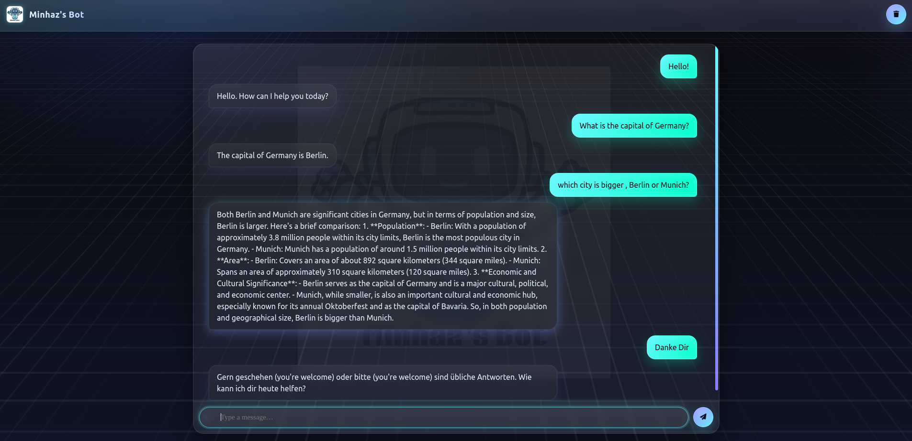

# 🤖 Minhaz's ChatBot

A simple yet professional **chatbot web app** powered by **FastAPI** on the backend and **Groq’s Llama 3.3** model for responses.  
The frontend is a sleek neon-glass styled chat interface built with vanilla **HTML, CSS, and JavaScript**.

---

## ✨ Features

- **FastAPI backend** with CORS enabled
- **Groq Llama 3.3-70b** for conversational responses
- **Modern UI**: neon-glass chat bubbles, subtle watermark branding
- **Real-time chat** with smooth scroll and input handling
- **Clear chat** functionality
- **Frontend + backend decoupled** (works locally or can be deployed separately)

---

## 📂 Project Structure
```bash
minhaz-chatbot/
├── backend/                   # FastAPI backend
│   ├── main.py                # FastAPI app (chat endpoint, Groq integration)
│   ├── requirements.txt       # Python dependencies
│   ├── .env                   # Environment variables (GROQ_API_KEY)
│
│
├── frontend/                  # Web client (static files)
│   ├── index.html             # Chat UI
│   ├── style.css              # Neon-glass chat styling
│   ├── script.js              # Chat logic (send, append, clear)
│   └── logo.jpg               # Logo
│       
├── Ui.png    
├── .gitignore                 # Ignore env, venv, pycache, etc.
├── README.md                  # Project documentation
└── LICENSE       
```

---

## ⚙️ Setup & Installation

### 1. Clone the repository
```bash
git clone https://github.com/yourusername/minhaz-chatbot.git
cd minhaz-chatbot
```

### 2. Backend (FastAPI)
Create a virtual environment
```bash
cd backend
python -m venv venv
source venv/bin/activate   # Linux / Mac
venv\Scripts\activate      # Windows
```

Install dependencies
```bash
pip install fastapi uvicorn groq python-dotenv
```
Environment variables
Create a .env file in the backend folder:
```bash
GROQ_API_KEY=your_groq_api_key_here
```
Run the backend
```bash
uvicorn main:app --reload
```
By default, the backend runs at:
👉 http://127.0.0.1:8000

### 3. Frontend (HTML/CSS/JS)
Just open frontend/index.html in your browser.
It will send requests to the FastAPI backend on http://127.0.0.1:8000/chat.

## Usage
* Start the FastAPI server (uvicorn main:app --reload).
* Open index.html in your browser.
* Type a message and hit send ✈️.
* The bot will reply using Groq Llama 3.3-70b.

## Preview





## License
MIT License — feel free to use, modify, and share.

